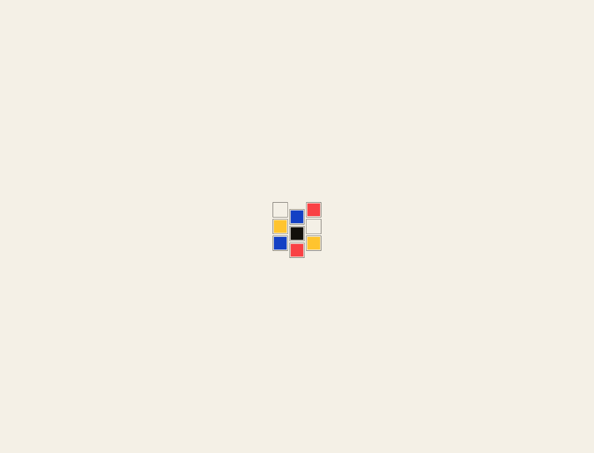

# Div & Conquer Collective

Static homepage for Div & Conquer Collective, deployed with GitHub Pages.



## Live site

[https://divandconquer-llc.github.io/DivAndConquer-Website/](https://divandconquer-llc.github.io/DivAndConquer-Website/)

## Project structure

- `index.html` - standalone homepage file.
- `assets/homepage-screenshot.png` - current homepage screenshot used in this README.
- `.nojekyll` - keeps GitHub Pages from running the site through Jekyll.

## Local preview

Open `index.html` directly in a browser, or serve the folder with any static server:

```powershell
npx serve .
```

## Deployment

GitHub Pages is configured to publish from the root of the `main` branch. Any commit pushed to `main` will update the live site after the Pages build completes.

## Updating the screenshot

After changing the homepage, refresh the screenshot from the repository root:

```powershell
& 'C:\Program Files (x86)\Microsoft\Edge\Application\msedge.exe' --headless --disable-gpu --hide-scrollbars --window-size=1440,1100 --screenshot='assets\homepage-screenshot.png' 'https://divandconquer-llc.github.io/DivAndConquer-Website/'
```
